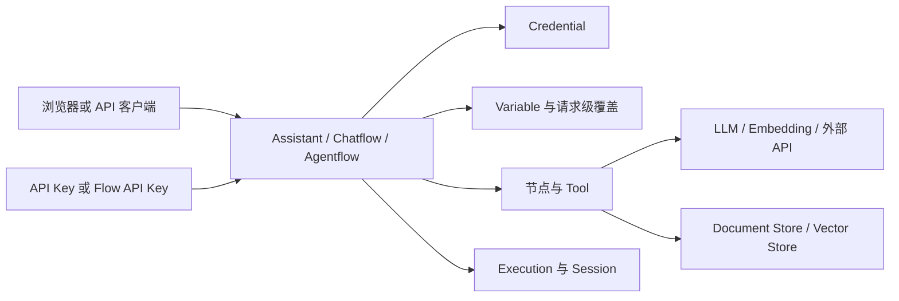

# 系统认知

## FlowAgentic 与上游 Flowise

FlowAgentic 是基于 Flowise `3.1.3` 的定制部署。理解功能时要同时回答三个问题：

1. 上游 Flowise 在该版本中定义了什么语义；
2. 固定提交 `6a5bb28b…` 实际包含什么代码和配置；
3. 当前部署是否启用了该能力，并在目标环境完成了验证。

只有三者一致，才能把结论写成“当前可用”。代码存在但未启用的功能必须标为 `feature-gated` 或 `upstream-only`。

## 三种构建对象怎样选择

| 对象 | 适合问题 | 主要特点 | 不优先使用的情况 |
| --- | --- | --- | --- |
| 自定义助手 | 快速组合模型、指令、知识库和工具 | 配置集中、上手快 | 需要复杂条件、循环或多阶段状态 |
| 对话流程 Chatflow | 可视化构建问答、RAG 和工具调用链 | 节点连接直观，适合线性或有限分支 | 需要显式触发器、HITL、循环或子流程 |
| Agentflow V2 | 多步骤 Agent、条件、循环、HITL、Webhook 和 Schedule | 状态与控制流更强 | 只是单次简单问答 |

第一性原则：从最小可验证对象开始。能用一个简单 Chatflow 解决的问题，不要先引入循环和多个 Agent。

## 核心对象关系

- **Credential** 保存访问外部系统的秘密；流程只引用它，不复制明文。
- **Variable** 保存可替换的配置；`$vars` 可在节点中读取，是否允许请求级覆盖取决于接口与安全策略。
- **API Key** 用于调用接口；它不是 Provider 凭据，也不能代替页面登录会话。
- **Tool** 把有边界的能力暴露给流程；其参数 Schema 是模型与真实系统之间的契约。
- **Document Store** 管理从文档载入、切分、嵌入、写入到检索的生命周期。
- **Execution** 是一次运行的可观测证据；它不等于业务写入成功，外部系统仍需自己的回执。

## 一次请求的数据流

1. 浏览器或 API 客户端携带会话或 API Key 发起请求。
2. 服务端校验身份、流程访问权限与请求参数。
3. 流程加载节点、凭据引用、变量和会话状态。
4. 节点可能读取文档库、调用 Provider、执行工具或访问外部 API。
5. 运行状态、节点输入输出、错误和耗时写入执行记录。
6. 服务端以普通响应或 Streaming 返回结果。

安全边界位于每一次跨系统调用处。任何 Tool、HTTP、MCP 或自定义代码节点，都必须单独说明写入、费用、超时、重试和数据出境。

## 管理员单账号与注册关闭

当前培训基线按“管理员单账号、不开设公开注册”设计。公开站不保存管理员邮箱或密码。账号初始化、轮换和恢复只通过受控渠道与私有 Runbook 完成。

## 术语使用

正文优先使用统一中文：对话流程、执行记录、自定义助手、模板市场、凭据、变量、API 密钥、文档库。API、SDK、LLM、RAG、MCP、SSO、OAuth、JSON、HTTP、URL、UUID、DeepSeek、Kimi 等保留业界缩写，并在首次出现时解释。

## 证据边界

本章心智模型绑定固定源码提交；该提交进入同版本隔离环境后仍需执行运行差异复核。正式截图、写入实验和 Provider 结果继续受 G1、培训环境与费用门禁约束。
