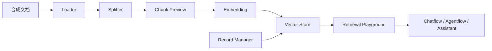

# 文档库与 RAG

## 生命周期

创建文档库只是建立配置对象。只有载入、切分、嵌入和 Upsert 成功后，文档才可能被检索。

## 建库 SOP

### 1. 定义知识边界

写清业务问题、允许的数据、更新时间、责任人和删除策略。培训只用虚构企业资料。

### 2. 载入

选择适配 PDF、Markdown、CSV 或网页的 Loader。使用稳定文件名和文档 ID，保留来源、版本和更新时间 metadata。

检查点：载入数量、文件类型和字符编码符合预期；无真实个人数据。

### 3. 切分与预览

根据文档结构选择 Splitter。先看 Chunk Preview，再决定 chunk 大小和 overlap。表格、标题和问答对需要保留语义边界。

检查点：每个 chunk 能独立回答一个小问题；不会把标题与正文、问题与答案拆散。

### 4. Embedding 与 Vector Store

选择模型、维度、Vector Store 和集合。Embedding 模型或维度变化时不要直接写入旧集合；建立新版本并重新索引。

检查点：凭据来自秘密存储；集合属于培训环境；费用 ledger 已开始记录。

### 5. Process／Upsert

执行前记录文档指纹、目标集合和预计数量。运行后核对状态、成功条目、失败条目和历史。Record Manager 用于跟踪变化时，要验证新增、更新和删除语义。

### 6. Retrieval Playground

准备一组有答案、无答案、同义改写和冲突问题。观察 Top K、相似度、metadata 过滤与返回片段；先修复检索，再调整生成提示。

### 7. 接入流程

将已验证的文档库连接到 Chatflow、Agentflow 或 Assistant。回答要求引用来源，检索为空时明确说不知道。

## 质量诊断

| 症状 | 可能原因 | 最小验证 |
| --- | --- | --- |
| 检索为空 | 未 Upsert、过滤过严、查询不匹配 | 在 Playground 用原文关键词查询 |
| 状态 Stale | 源文档或配置变化但索引未同步 | 比对文档指纹与最后处理时间 |
| 维度错误 | Embedding 模型与既有集合不一致 | 核对模型和集合维度 |
| 结果不相关 | chunk 过大／小、metadata 缺失 | 固定问题对比不同切分策略 |
| 删除后仍召回 | Record Manager 或旧集合残留 | 按文档 ID 查询目标集合 |
| 回答有幻觉 | 检索质量差或提示未约束 | 分离检查 retrieved context 与生成 |

## 回退与清理

保留上一版只读集合，验证新集合后再切换引用。切换失败时恢复旧引用，不覆盖原集合。实验结束按 ledger 删除文档库、集合、文件和执行记录，并做残留查询。

## 正式截图计划

覆盖创建、Loader、Splitter、Chunk Preview、metadata、Embedding、Vector Store、Process、Upsert 历史、状态、Playground、接入流程和故障状态。G1 前不使用旧截图。

## 目标

把合成资料可靠地转化为可检索文档库，并用有答案、无答案、冲突和删除四类问题证明 RAG 质量与清理语义。

## 适用角色

搭建者负责 Loader／Splitter／检索，开发者负责数据源和 Vector Store，管理员负责凭据、费用、删除与数据边界。

## 适用版本与功能状态

文档库为基线十个 `production-enabled` 主模块之一；各 Loader、Embedding 和 Vector Store 依赖需按节点目录和目标环境复核。

## 前置条件与风险

需要无个人信息的合成 PDF／Markdown／CSV、稳定文档 ID、Embedding 凭据、独立集合、费用余量和删除查询。Upsert 会写向量存储并可能出境。

## 初始状态

确认文档库和目标集合无同名实验对象，文件指纹已登记，旧索引保持只读，Provider 预算和对象 ledger 已开启。

## 操作步骤

定义边界 → Loader 载入 → Splitter 预览 → metadata 检查 → 选择 Embedding／Vector Store → Process／Upsert → Playground 对照 → 接入流程 → 版本切换。

## 逐步检查点

文件数和编码正确；chunk 保留语义；模型维度与集合一致；Upsert 成功／失败数可解释；检索返回正确来源；删除后不再召回。

## 成功结果

有答案问题召回正确片段，无答案问题为空或拒答，冲突资料可追溯来源，删除文档不再被目标集合检索。

## 常见错误与诊断

空召回检查 Upsert 和过滤；Stale 比对指纹；维度错建立新集合；不相关先修 chunk/metadata；删除残留按文档 ID 查 Record Manager 和旧集合。

## 安全提示

仅发送合成资料；metadata 也可能含个人信息。切换 Embedding 不覆盖旧集合，外部 Vector Store 使用最小权限和明确删除策略。

## 练习任务

用虚构企业手册建立文档库，对四组问题比较两种切分策略，选出一版并完成旧集合和源文件清理。

## 验收清单

- [ ] Loader、Splitter、metadata、Embedding、Vector Store、Upsert 全链可追溯。
- [ ] 四类检索问题和接入流程通过。
- [ ] 费用、秘密、个人信息和删除残留检查通过。

## 来源与验证

阶段状态、Upsert 前置和副作用引用 `CLM-007/019/023`；这些 Claim 完成培训环境复现前，正式发布门禁保持失败。
