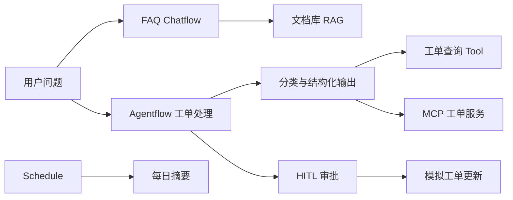

# 企业知识与工单贯穿实战

## 场景

虚构企业“星桥科技”提供企业软件服务。培训环境包含虚构员工、产品、FAQ、支持政策和工单。所有邮箱、电话、域名、订单、工单号和文档均为合成数据。

## 最终链路

## 实验阶段

### 实验一：企业 FAQ Chatflow

建立最小问答流程，限制回答范围，并从合成 FAQ 验证正常与无答案问题。

### 实验二：文档库 RAG 助手

载入合成 PDF、Markdown 和 CSV，完成切分、Embedding、Upsert 和 Retrieval Playground，再接入 Chatflow。

### 实验三：工单分类

使用 LLM 输出严格结构：类别、优先级、摘要、需要人工审核。对 Schema 不匹配设置明确失败分支。

### 实验四：查询 Tool 与 MCP

创建只读工单查询 Tool，再连接模拟 MCP 服务。比较直接 Tool 与 MCP 的认证、Schema、错误和撤销边界。

### 实验五：条件分流与 HITL

用 Condition 按优先级和风险分流。任何工单更新先进入 STOPPED，人工选择 Proceed 或 Reject 后再继续。

### 实验六：定时摘要

在培训环境验证 Schedule 时区、重复执行和漏触发恢复；输出只含合成工单。

### 实验七：Provider 切换

DeepSeek 为主线，Kimi 为备用。使用相同输入和结构化输出 Schema，对比正确性、延迟、token 和费用。切换是受控配置，不把 Provider Key 放进流程。

## 费用与 Provider 门禁

凭据未通过安全渠道进入培训环境前，本实验不发出任何真实调用。每次调用记录 Provider、模型、token、延迟和估算费用；累计达到人民币 300 元立即停止，CI、站点构建和 PDF 构建始终禁止调用 Provider。

## 对象 ledger

每个实验记录：

- 对象类型、名称和 ID；
- 创建人、创建时间和目标环境；
- 基线指纹与依赖；
- Provider 调用与费用；
- 清理动作、回执和残留检查。

## 验收

- 正常、失败、空状态、权限不足、限流和恢复 fixture 均有结果。
- 工单写入只发生在模拟 API，并具备幂等与回执。
- 两条 Provider 主链均在总预算内成功；未完成时明确标为门禁未通过。
- 实验结束没有临时凭据、向量集合、流程、会话和工单残留。
