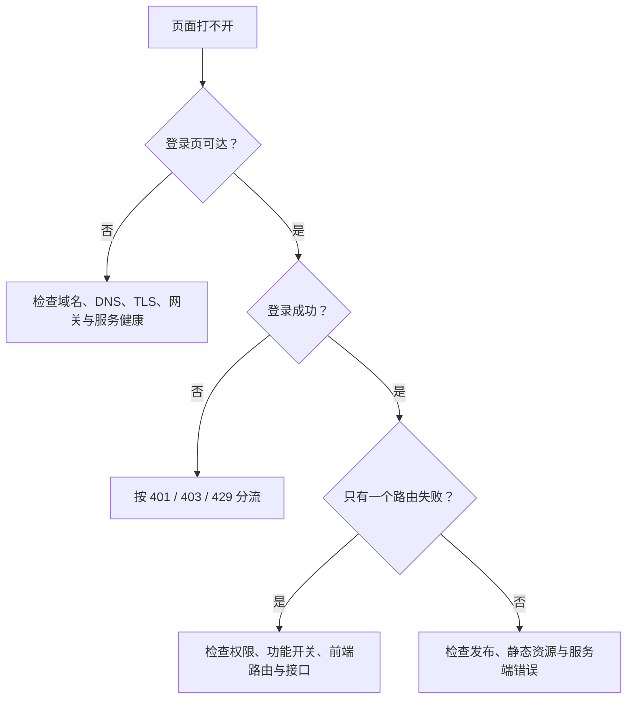
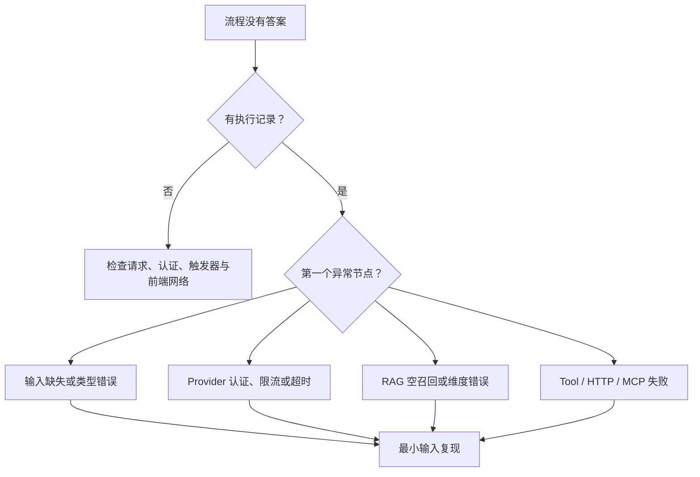

# 故障决策树速查

## 页面打不开

```mermaid
flowchart TD
    A["页面打不开"] --> B{"登录页可达？"}
    B -- 否 --> C["检查域名、DNS、TLS、网关与服务健康"]
    B -- 是 --> D{"登录成功？"}
    D -- 否 --> E["按 401 / 403 / 429 分流"]
    D -- 是 --> F{"只有一个路由失败？"}
    F -- 是 --> G["检查权限、功能开关、前端路由与接口"]
    F -- 否 --> H["检查发布、静态资源与服务端错误"]
```

## 流程没有答案

```mermaid
flowchart TD
    A["流程没有答案"] --> B{"有执行记录？"}
    B -- 否 --> C["检查请求、认证、触发器与前端网络"]
    B -- 是 --> D{"第一个异常节点？"}
    D --> E["输入缺失或类型错误"]
    D --> F["Provider 认证、限流或超时"]
    D --> G["RAG 空召回或维度错误"]
    D --> H["Tool / HTTP / MCP 失败"]
    E --> I["最小输入复现"]
    F --> I
    G --> I
    H --> I
```

## 外部写入结果不确定

停止重试。用幂等键、请求 ID 或业务对象 ID 查询目标系统回执；FlowAgentic 执行成功只能证明流程完成到某一步，不能替代目标系统的业务确认。
