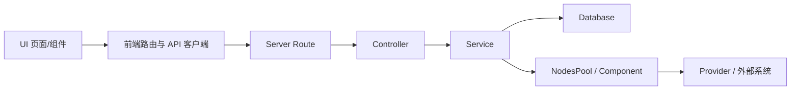

# 开发者专区

## 六包 monorepo 心智模型

| 包 | 主要职责 | 本 Playbook 状态 |
| --- | --- | --- |
| `server` | API、路由、控制器、服务、持久化与运行编排 | 生产主链 |
| `ui` | 页面、组件、路由、权限显示与交互 | 生产主链 |
| `components` | 节点、凭据、工具和集成实现 | 生产主链 |
| `api-documentation` | API 说明与参考 | 参考 |
| `agentflow` | Agentflow 相关包 | 需按目标提交与部署复核 |
| `observe` | 观测相关能力 | 实验／未完成本地生产验证 |

包存在不等于部署启用；状态必须结合功能开关、路由、权限和运行证据。

## 请求追踪路径

定位问题时从用户动作和网络请求开始，沿路径找到所有权边界。不要只凭文件名猜测运行时调用。

## 本地开发

1. 固定 Node、包管理器和依赖锁文件版本。
2. 从干净、独立分支开始，先运行基线构建和测试。
3. 只修改与目标行为相关的最小文件集合。
4. 对配置、迁移、权限和公开 API 做兼容性评审。
5. 分层运行类型检查、单元、集成、服务和浏览器验收。
6. 提交中不包含 `.env`、凭据、真实数据、构建缓存或本地调试文件。

具体安装命令以目标提交的仓库说明和锁文件为准，避免把会漂移的本地命令写成长期事实。

## 添加自定义节点

- 定义唯一名称、标签、类别、版本和图标。
- 明确输入、输出、凭据、默认值和错误。
- 标记外部调用、费用、写入、数据出境和超时。
- 对初始化、运行、空输入、错误、超时与取消编写测试。
- 确认节点发现、画布显示、保存、导入导出和执行记录。
- 更新自动生成的节点目录，而不是手工维护重复清单。

## 添加 Credential

字段只声明必要秘密，UI 默认遮罩；服务端日志和错误不得回显值。测试创建、更新、轮换、引用和删除，验证加密密钥变化下的连续性边界。

## API 与 Streaming 开发

接口要有认证、权限、Schema 校验、错误码、限流和审计。Streaming 还需处理代理缓冲、客户端取消、断线和最终状态。错误响应对用户可理解，对攻击者不过度暴露内部实现。

## 中文与权限规范

主文案使用统一中文术语；白名单缩写首次出现时解释。按钮使用明确动词，危险操作同时说明对象和后果。前端隐藏只改善体验，服务端仍必须执行权限检查。

## 升级与上游同步

1. 固定上游来源和目标提交。
2. 生成本地差异清单，按 UI、API、数据、节点和运维分类。
3. 先在隔离环境完成迁移与回归。
4. 更新 Claim—Evidence、节点目录、SOP 和截图 manifest。
5. 通过发布门禁后再更新 Playbook 版本与 `latest`。
