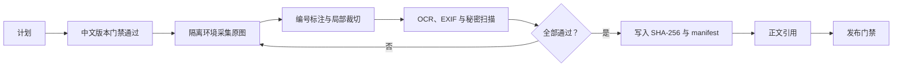

# 截图与脱敏合同

当前仓库已有 252 张截图的确定性采集计划，但没有把计划伪装成截图证据。只有满足以下状态机后，图片才进入公开站：

## 采集标准

- PC 基线为 `1440x1000@100%`、`zh-CN`、浅色主题。
- 普通动作覆盖操作前、操作中、成功；高风险动作增加失败和恢复。
- 原图保留 PNG；公开完整图使用 WebP，单图不超过 500 KiB。
- 深色主题只采导航和画布代表图。
- 每张图片必须绑定目标发布 SHA、角色、路由、fixture、状态和中文替代文本。

## 公开前检查

必须确认 OCR、EXIF、邮箱、IP、域名、Token、Key、Cookie、UUID、本机路径与真实资源标识均无泄露。任何一项未通过，`redaction_status` 都不能标为 `passed`。

生产环境只允许只读交叉核验；所有会创建、更新、删除、调用 Provider 或产生费用的截图必须在隔离培训环境完成。
